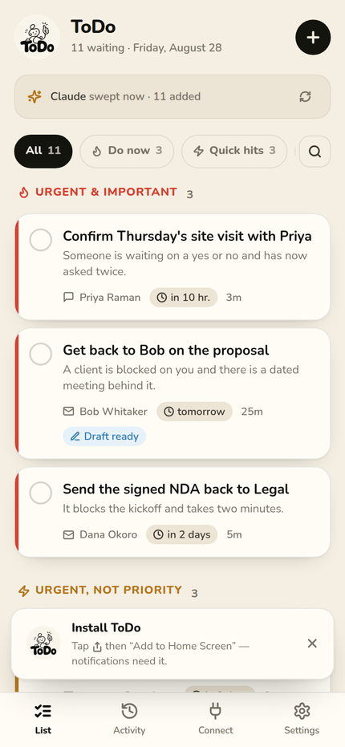
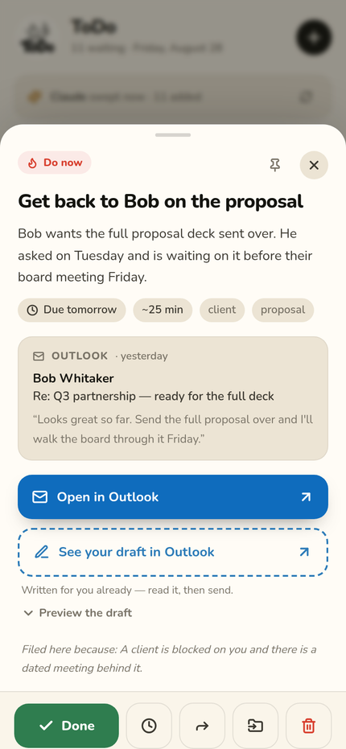
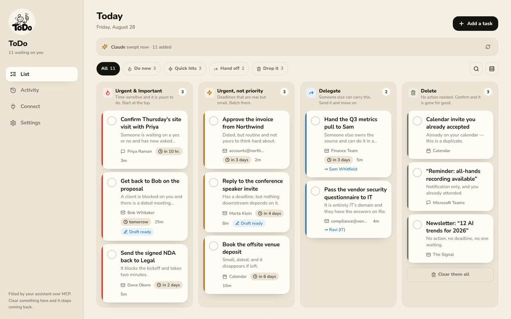
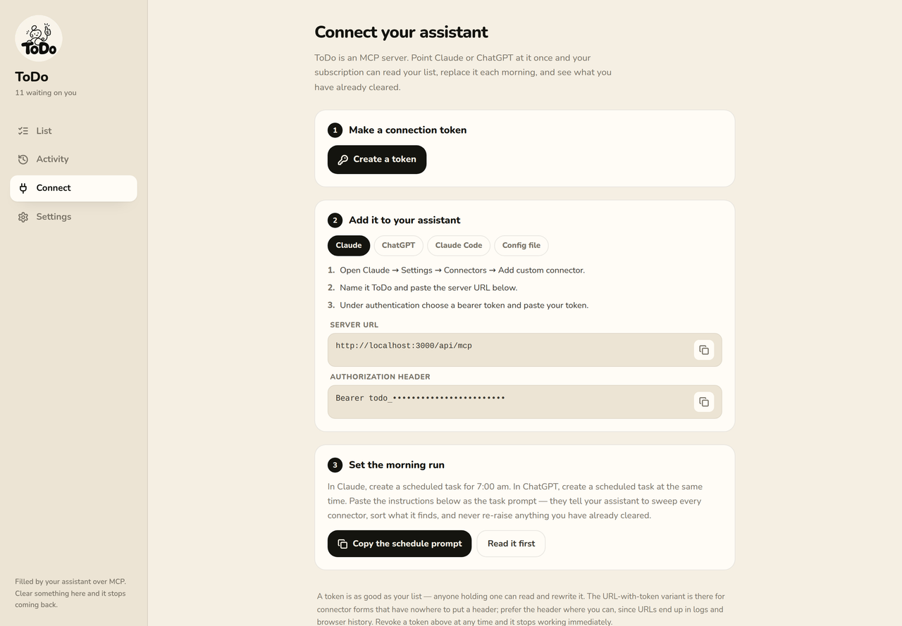

<div align="center">


# ToDo

**Your assistant reads every inbox, calendar and chat you have.
It sorts what is left into four buckets.
Each one is a single tap from done.**

</div>

---

ToDo is a task inbox you never fill in yourself.

Your Claude or ChatGPT subscription already has connectors into Outlook, Gmail, Teams, Zoom and the rest. ToDo is an **MCP server** those assistants can write to. Point yours at it, give it a schedule, and every morning it sweeps a rolling window across everything you are connected to, works out what actually needs you, and rewrites your list.

Then you open the app and clear it. Tap a task, read the two-line version of what happened, and hit **Open in Outlook** — which lands on the exact message, in the desktop app on your laptop and the phone app in your pocket. If the assistant already wrote the reply, there is a second button that opens that exact draft. Read, send, done.

And when you clear something, **the app tells your assistant**. That is the part that makes it work day after day.

## The problem this solves

An agent looking at a rolling fourteen-day window sees the same email every morning. Bob wrote on Tuesday. You never replied — you called him instead. To the mailbox it still looks unanswered, so tomorrow you get "get back to Bob" again. And the day after.

So every action you take in the app writes a **suppression** keyed on the message's own stable id. Before an assistant writes anything it reads that list, and anything on it is refused and reported back:

```json
{
  "created": 11,
  "removed": 3,
  "skipped": 1,
  "skippedTasks": [
    {
      "sourceKey": "outlook:email:AAMkAGI2TG93AAA=",
      "title": "Get back to Bob on the proposal",
      "action": "completed",
      "reason": "already marked done in the ToDo app",
      "handledAt": "2026-08-27T14:02:11.000Z"
    }
  ]
}
```

Undo a completion and the suppression is lifted, so it can legitimately come back. Snooze something and the suppression expires on its own when the snooze does.

## The four buckets

| Bucket | Means |
| --- | --- |
| **Urgent & Important** | Time-sensitive and it is yours to do. Start at the top. |
| **Urgent, not priority** | Deadlines that are real but small. Batch them. |
| **Delegate** | Someone else can carry this. The task names who. |
| **Delete** | No action needed. Confirm and it is gone for good. |

`Delete` is a real bucket, not a bin. The assistant puts things there so you can *confirm* they can go — which is how the noise actually clears instead of being quietly ignored.

## What you get

- **One app, both devices.** Installable PWA — home screen on iOS and Android, standalone window on macOS and Windows. Responsive from a 390px phone to a wide desktop board.
- **Push notifications everywhere.** Web Push over VAPID, on phone and desktop. A morning digest at whatever hour you pick, in *your* timezone, plus due-soon reminders and quiet hours.
- **Deep links that land.** Every task carries up to three URLs — browser, desktop app, phone app — and the app picks the right one for the device in your hand. Custom schemes (`ms-outlook://`, `msteams:/`, `zoommtg://`) fail silently when the app is not installed, so ToDo notices and offers the browser instead.
- **Drafts.** When the assistant writes a reply into your drafts folder, the task shows *See your draft in Outlook* next to the open button.
- **Undo on everything.** Every completion, dismissal, snooze and hand-off can be taken back, which also lifts the suppression.
- **A visible feedback loop.** The Activity tab shows every sweep and, crucially, everything the app refused to let the assistant re-raise.

## Screens

<p align="center">
  
  &nbsp;&nbsp;
  
</p>

<p align="center"><em>Left: the list, in the order you should work it. Right: one tap in, and two buttons finish the job.</em></p>

<p align="center">
  
</p>

<p align="center"><em>The four buckets on a wide screen. The Delete column clears in one action.</em></p>

<p align="center">
  
</p>

<p align="center"><em>Connect generates the token and hands you the exact settings and schedule prompt.</em></p>

## Getting started

```bash
git clone https://github.com/jamiebaum321-hue/ToDo.git
cd ToDo
npm install

cp .env.example .env
npm run gen:vapid          # optional, but push needs it — paste the keys into .env

docker compose up -d db    # PostgreSQL on :5432 (or point DATABASE_URL anywhere)
npm run setup              # applies migrations and seeds a sample list
npm run dev
```

Open <http://localhost:3000>. The seed signs you in with `you@example.com` / `todo1234` — change both in `.env` before seeding if you would rather not.

Starting empty instead? Skip `npm run setup`, run `npm run db:deploy`, and the first visit walks you through creating your account. **Registration closes after the first account**, so nobody else can claim your instance. Set `ALLOW_SIGNUPS=true` to keep it open.

You need a Postgres for the tests too — `npm test` wipes and rebuilds whatever `TEST_DATABASE_URL` points at, which the compose file above already provides.

## Connecting your assistant

In the app, go to **Connect**. It generates a token and shows the exact settings for each client. In short:

**Claude** — Settings → Connectors → Add custom connector

```
URL:   https://your-todo-app.com/api/mcp
Auth:  Authorization: Bearer todo_xxxxxxxx
```

**Claude Code**

```bash
claude mcp add --transport http todo https://your-todo-app.com/api/mcp \
  --header "Authorization: Bearer todo_xxxxxxxx"
```

**Any client with an `mcp.json`**

```json
{
  "mcpServers": {
    "todo": {
      "type": "http",
      "url": "https://your-todo-app.com/api/mcp",
      "headers": { "Authorization": "Bearer todo_xxxxxxxx" }
    }
  }
}
```

Some connector forms only accept a URL with nowhere to put a header. For those there is `https://your-todo-app.com/api/mcp/t/<token>`, which carries the token in the path. Prefer the header where you can — URLs end up in logs and browser history.

### The morning run

Create a scheduled task in Claude or ChatGPT for 7:00 am and paste the prompt the **Connect** page gives you (it is also served over MCP as the `daily_triage` prompt). It tells your assistant to:

1. call `get_run_context` **first** — which returns everything you have already handled;
2. sweep every connector across the rolling window;
3. sort what it finds into the four buckets, with a source link on every task;
4. draft the easy replies into your drafts folder;
5. send the whole list in one `sync_tasks` call with `replace: "window"`;
6. read `skippedTasks` in the response and stop suggesting those.

## The MCP surface

| Tool | What it does |
| --- | --- |
| `get_run_context` | **Call first.** Local time, rolling window, bucket definitions, the current list, and everything you have already handled. |
| `sync_tasks` | Write the whole list in one call. `replace: "window"` clears anything left out, so the list is genuinely replaced. Refuses anything already handled and says why. |
| `get_handled_items` | The suppression list, or a yes/no for specific source keys. |
| `list_tasks` / `get_task` | Read the list, by filter or by id/sourceKey. |
| `create_task` / `update_task` | Add or change one task without touching the rest. |
| `complete_task` / `snooze_task` / `reopen_task` / `delete_task` | Act on a task on your behalf. |
| `attach_draft` | Attach a reply saved in your drafts, adding the "See your draft" button. |
| `send_notification` | Push to every device you are signed in on. Respects quiet hours. |
| `get_stats` | Counts per bucket, overdue, and recent runs. |

Prompts: `daily_triage`, `quick_capture`, `end_of_day`.
Resources: `todo://buckets`, `todo://open`, `todo://handled`, `todo://settings`.

Transport is Streamable HTTP (protocol `2025-06-18`, with `2025-03-26` and `2024-11-05` accepted), implemented directly as a Next.js route handler.

### Giving a task its buttons

The buttons come from the `source` block. Send whatever the connector gave you and ToDo derives the rest:

```json
{
  "title": "Get back to Bob on the proposal",
  "bucket": "urgent_important",
  "description": "Bob wants the full proposal deck sent over. He asked Tuesday and is waiting on it before their board meeting Friday.",
  "reason": "A client is blocked on you and there is a dated meeting behind it.",
  "dueAt": "2026-08-29T17:00:00Z",
  "source": {
    "provider": "outlook",
    "type": "email",
    "externalId": "AAMkAGI2TG93AAA=",
    "from": "Bob Whitaker <bob@acme.com>",
    "subject": "Re: Q3 partnership — ready for the full deck",
    "snippet": "Send the full proposal over and I'll walk the board through it Friday.",
    "url": "https://outlook.office.com/mail/deeplink/read/AAMkAGI2TG93AAA%3D"
  },
  "draft": {
    "provider": "outlook",
    "kind": "reply",
    "body": "Hi Bob, the full proposal is attached…",
    "externalId": "AAMkAGI2TG93AAA=-draft"
  }
}
```

A URL the connector supplied always wins over a derived one. Where none is given, ToDo builds what it can:

| Provider | Browser | Desktop | Phone |
| --- | --- | --- | --- |
| Outlook | `outlook.office.com/mail/deeplink/read/…` | `ms-outlook://` | `ms-outlook://emails/message?restId=…` |
| Gmail | `mail.google.com/…#search/rfc822msgid:…` | — | same https link (app links handle it) |
| Teams | the permalink | `msteams:/l/message/…` | `msteams:/l/message/…` |
| Zoom | `zoom.us/j/…` | `zoommtg://…` | `zoommtg://…` |
| Slack | `…slack.com/archives/…` | `slack://channel?…` | `slack://channel?…` |

Gmail's most durable link is built from the RFC-822 `Message-ID` — it survives label moves and works across accounts — so send `messageId` when you have it.

## Deploying

**Vercel + Neon** — the deployment this is built for. Add a Postgres store to the project (Storage → Create → Neon) and the database side needs nothing else: the integration injects `DATABASE_URL` and `DATABASE_URL_UNPOOLED`, and the build resolves those into what Prisma wants. Vercel Postgres' `POSTGRES_PRISMA_URL` / `POSTGRES_URL_NON_POOLING` work too, as does setting `DATABASE_URL` and `DIRECT_URL` by hand.

Then set the rest:

| Variable | Value |
| --- | --- |
| `NEXT_PUBLIC_APP_URL` | your deployment URL |
| `VAPID_PUBLIC_KEY`, `VAPID_PRIVATE_KEY`, `NEXT_PUBLIC_VAPID_PUBLIC_KEY`, `VAPID_SUBJECT` | from `npm run gen:vapid` |
| `CRON_SECRET` | any long random string |

`npm run build` applies pending migrations before `next build`, so each deploy brings the database up to date on its own. `vercel.json` registers the 15-minute cron.

Two details the build handles for you, because getting either wrong fails quietly and late. A serverless function opens a connection per invocation, so the runtime must use the **pooled** endpoint — and that endpoint is PgBouncer in transaction mode, which cannot hold the prepared statements Prisma creates, so the pooled URL gets `?pgbouncer=true` appended automatically. Migrations meanwhile need a real session, so they always run against the **unpooled** endpoint.

**Docker** (Postgres and the scheduler, all in compose)

```bash
cp .env.example .env      # fill in the VAPID keys
docker compose up -d --build
```

**A VPS** — `npm run build && npm start` against any Postgres, plus `npm run worker` alongside it for the digests.

### Scheduled housekeeping

`/api/cron/tick` wakes snoozed tasks, sends each user their digest at their own local time, fires due-soon reminders and archives what is old. Call it every 15 minutes:

```bash
curl -H "Authorization: Bearer $CRON_SECRET" https://your-todo-app.com/api/cron/tick
```

Or run `npm run worker`, which does the same in-process and needs no cron at all. Both are idempotent and safe to run together.

## How it fits together

```
Claude / ChatGPT                 ToDo                       You
─────────────────                ────                       ───
Outlook, Gmail,
Teams, Zoom, …
      │
      │  reads via its own connectors
      ▼
  triage into 4 buckets
      │
      │  sync_tasks (MCP, one call)
      ▼
   ┌────────────────────────┐
   │  tasks + source links  │ ──────────────────▶  tap → Outlook / Gmail / Teams
   │  + drafts              │                      tap → your draft reply
   └────────────────────────┘                                │
      ▲                                                      │ mark it done
      │  get_run_context / skippedTasks                      ▼
   ┌────────────────────────┐                        ┌────────────────┐
   │  already handled       │ ◀──────────────────────│  suppression   │
   └────────────────────────┘                        └────────────────┘
```

### Layout

```
src/
  app/                     pages and route handlers
    api/mcp/               the MCP endpoint (+ /t/[token] variant)
    api/cron/tick/         scheduled housekeeping
  lib/
    db-url.ts              resolving whatever connection strings the host injected
    sync.ts                the write path: upsert, replace, refuse
    suppression.ts         the memory that stops repeats
    deeplinks.ts           three URLs per link, and picking the right one
    actions.ts             complete / snooze / delegate / undo
    mcp/                   protocol, tools, prompts, transport
  components/app/          the UI
prisma/schema.prisma       PostgreSQL; no enums or Json columns, so it reads as plain SQL
prisma/migrations/         checked-in SQL, applied by `prisma migrate deploy`
tests/                     137 tests, including tenant-isolation and Postgres integration suites
```

### Commands

```bash
npm run dev            # development server
npm run setup          # migrate + seed
npm test               # 137 tests, against a real Postgres
npm run typecheck      # tsc --noEmit
npm run build          # migrate + production build
npm run build:no-migrate  # build only, for CI and Docker images
npm run db:migrate     # create a migration from a schema change
npm run db:deploy      # apply pending migrations
npm run worker         # standalone scheduler
npm run gen:vapid      # mint push keys
npm run gen:icons      # rebuild every brand asset from assets/logo-source.png
```

## Notes on security

- Passwords are scrypt with a per-password salt. Session and API tokens are stored only as SHA-256 hashes — the plaintext of a connection token is shown exactly once, at creation.
- A connection token can read and rewrite your whole list. Revoke one from **Connect** and it stops working immediately.
- **Single-tenant by default, multi-tenant capable.** Registration closes after the first account unless `ALLOW_SIGNUPS=true`. Every row is keyed by `userId` and every query path scopes to the caller, which `tests/isolation.test.ts` proves from 29 angles — including that two accounts can hold the same email's `sourceKey` without colliding, and that one account clearing a task never suppresses it for another.
- Isolation is enforced in application code, not in database row-level security. That is sound for the paths that exist and is regression-tested, but before opening this up to strangers you would also want: email verification, password reset, and rate limiting on `/api/auth/login` and `/api/mcp`. None of those are here.
- `/api/cron/tick` is open in development and requires `CRON_SECRET` in production; without the secret set, it returns 503 rather than running unauthenticated.
- The service worker never caches `/api/*`, so nobody else's session can pick up your list from a shared browser.
- `DATABASE_URL` and `DIRECT_URL` are the only database secrets; neither is exposed to the browser (nothing prefixed `NEXT_PUBLIC_` touches them).

## Licence

MIT.
